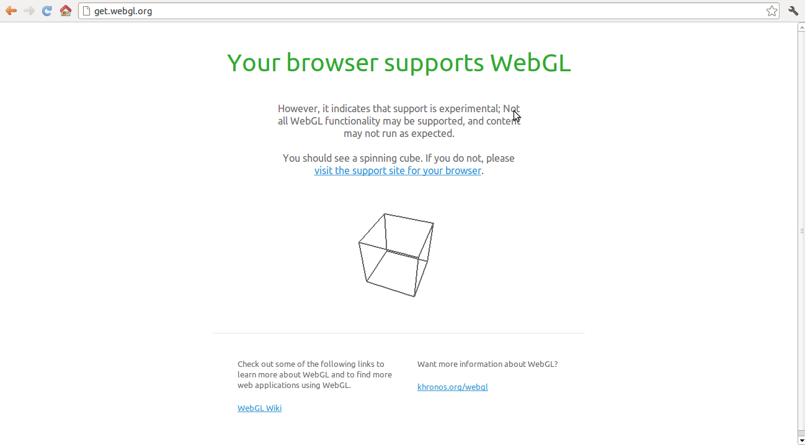

# Tutorial de Three.js

Tutorial en español que explica como utilizar la libreria Three.js.
* * *
### Preparando el terreno

Para poder utilizar Javascript o cualquiera de sus librerías, no necesitamos instalar nada, pero si habilitar 
en el navegador la utilización de WebGL.

* ####Google Chrome

* * <b>Paso 1:</b> Abre el navegador y en la barra de direcciones escribe: chrome://flags/ 

* * <b>Paso 2:</b> Desde esta página podemos habilitar soporte adicional al navegador web, en nuestro caso para WebGL, necesitas “habilitar” los siguientes experimentos: 

* * * WebGL (Importante)
* * * Ignorar la lista de renderización por software (Opcional si no funciona con el primero)
* * * Canvas 2D acelerado por GPU (opcional) 
* * <b>Paso 3:</b> Reinicia el navegador.
 
* * <b>Paso 4: </b> Abre esta página. <a href="http://get.webgl.org/">get.webgl.org</a> , te debería salir algo así: 
 